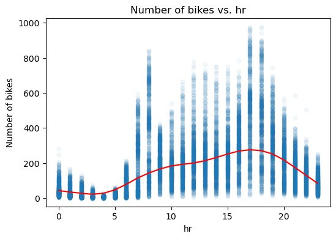
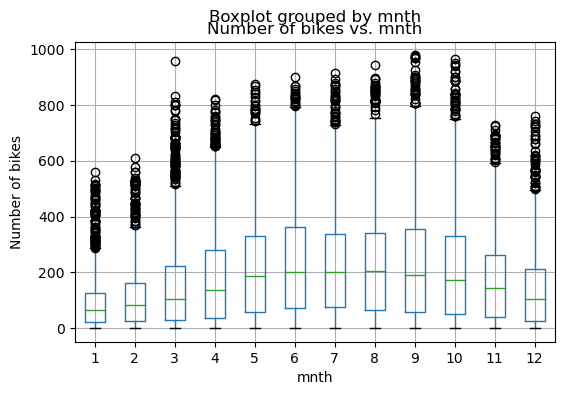
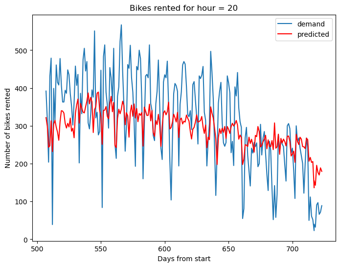

# Analyse et Prédiction de la Demande en Location de Vélos

## Contexte
Ce projet Jupyter offre une analyse détaillée et des prévisions de la demande de location de vélos, avec un accent particulier sur l'heure de pointe, à 20 heures. Nous utilisons des données historiques comprenant des variables météorologiques, temporelles et autres facteurs pertinents.

## Objectif
L'objectif est de comprendre les dynamiques affectant la demande de location de vélos et de créer un modèle prédictif fiable pour l'heure de pointe. Cela aidera les opérateurs de services de location à gérer leur flotte plus efficacement et à améliorer la mobilité urbaine.

## Analyse Statistique
- `bikesperhour.png` : Distribution horaire de la location de vélos, montrant les pics de demande à travers différentes heures de la journée.
- `bikespermonthboxplot.png` : Variation mensuelle de la location de vélos, présentée sous forme de boîte à moustaches pour souligner la dispersion et les tendances saisonnières.

## Prédictions
- `bikepredictionsh20.png` : Comparaison entre la demande réelle et les prédictions pour l'heure de pointe (20h), illustrant la précision de notre modèle prédictif.

## Conclusion
Le projet met en lumière les tendances significatives et permet de prendre des décisions éclairées pour répondre à la demande en constante évolution dans le secteur de la location de vélos.

